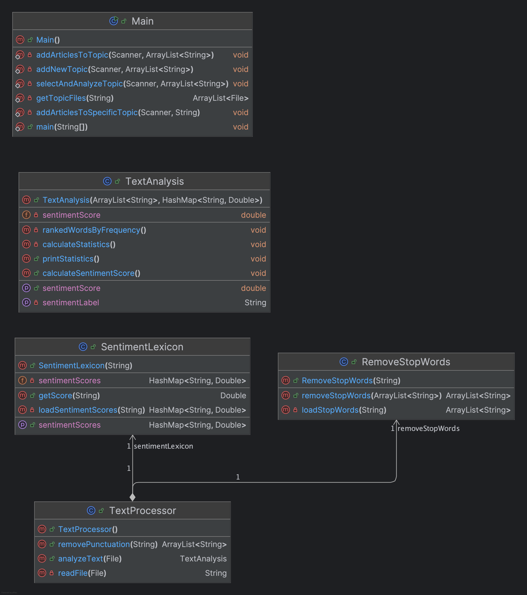

# Project Overview
A comprehensive text analysis application that processes article across multiple topics, performing statistical analysis, word frequency ranking, and sentiment analysis. Users can also add their own topics and articles via the interactive menu. 

# Features
- Text Preprocessing: Removes punctuation and common stop words from text files
- Statistical Analysis: Calculates total word count, unique words, and word frequencies
- Frequency Ranking: Ranks words by frequency using bubble sort
- Sentiment Analysis: Calculates sentiment scores using a lexicon-based approach
- Topic Management: Add new topics and articles through menus
- Multiple Topics: Processes articles from various categories (headphones, movies, Roman history, and custom user-imported topics)

# Classes

## Class Diagram


## Main.java
- Purpose: Main driver class with menu system  
- Responsibilities:
  - Manages user interaction through console menus
  - Handles topic selection and creation
  - Manages files and articles
  - Integrates all analysis components

## TextProcessor.java
- Purpose: Central processing unit for text analysis
- Responsibilities:
  - Reads text files using Scanner class
  - Removes punctuation from articles
  - Coordinates text preprocessing
  - Creates TextAnalysis objects for statistical processing
  - Integrates sentiment analysis functionality

## RemoveStopWords.java
- Purpose: Filters common words from text
- Responsibilities:
  - Loads stop words from external file
  - Filters out common words during text cleaning
  - Maintains a list of stop words for text processing

## TextAnalysis.java
- Purpose: Performs statistical analysis and sentiment calculation
- Responsibilities:
  - Calculates word statistics (total words and unique words)
  - Counts word frequencies using ArrayList class
  - Ranks word by frequency using bubble sort
  - Calculates sentiment scores and classifies sentiment (Very Positive to Very Negative)
  - Displays formatted analysis results

## SentimentLexicon.java
- Purpose: Manages sentiment scoring system
- Responsibilities:
  - Loads sentiment scores from lexicon file
  - Stores word-sentiment score mappings in a HashMap
  - Provides sentiment score lookup for individual words
  - Supports sentiment analysis calculations

# Code Quality: Coupling and Cohesion

## Main.java
- Cohesion: Medium-Low
  - Handles multiple responsibilities including user interaction, file management, topic management, and controlling analysis
  - Contains both high-level program control and low-level file operations
- Coupling: High
  - Directly depends on Scanner, File, ArrayList, and TextProcessor classes
  - Tightly coupled with file management through ```getTopicFiles()``` method

## TextProcessor.java
- Cohesion: Medium
  - Primary responsibility is text processing, but is also used for file reading and punctuation removal
  - Mostly focused on cleaning up text but could be broken down more
- Coupling: Medium-High
  - Depends on RemoveStopWords, SentimentLexicon, and TextAnalysis
  - Direct file system access for reading files

## TextAnalysis.java
- Cohesion: Medium-Low
  - Combines statistical analysis with sentiment analysis
  - Also handles sorting and output formatting
  - ```calculateStatistics()``` method does multiple things including counting, unique word identification, and sorting
- Coupling: Medium
  - Depends on ArrayList and HashMap data structures
  - Instead of depending on SentimentLexicon.java, it receives ```sentimentScores``` as a parameter

## SentimentLexicon.java
 - Cohesion: High
   - Single responsibility: loading and providing sentiment scores
   - All methods directly support this task
 - Coupling: Low
   - Minimal dependencies (only File, Scanner, and HashMap)
   - Could be easily replaces with a different sentiment calculator

## RemoveStopWords.java
- Cohesion: High
  - Single responsibility: filtering stop words from text
  - All methods directly support this task
- Coupling: Low
  - Minimal dependencies (File, Scanner, and ArrayList)
  - Receives words as a parameter, returns filtered list
  - Easy to test, reuse, or replace

# Refactoring Suggestions
 - Split Main.java - Separate menu logic, file operations, and overall program flow into different classes
 - Utilize parameters - Pass RemoveStopWords into TextProcessor instead of creating the object internally
 - Isolate sorting logic - Move the bubble sort from TextAnalysis in to its own class
 - Separate output formatting - Move print statements from TextAnalysis to separate formatter classes
 - Replacing hard-coded values - Replace values with variables to increase readability. For example, assigning each of the values in ```getSentimentLabel``` to variables with descriptive names
 - Improve error handling - Use consistent and descriptive error messages when something goes wrong. This allows for a better user experience, cleaner code, and easier debugging.

# Usage
```
========================================
Welcome to Text Analysis using Java!
========================================
1. Select a topic
2. Add a new topic
3. Add articles to existing topic
4. Exit
Enter your choice: 
```

# Example Results
## Selecting a Topic to Analyze
```
========================================
Welcome to Text Analysis using Java!
========================================
1. Select a topic
2. Add a new topic
3. Add articles to existing topic
4. Exit
Enter your choice: 1

--- Available Topics ---
1. headphones
2. movies
3. roman
Select a topic (enter number): 1

--- Analyzing topic: headphones ---

>>> Processing file: article1.txt
===========================================
           TEXT ANALYSIS RESULTS           
===========================================
Total words: 755
Unique words: 457
Sentiment Score: 0.72
Sentiment: Positive

Top 10 Most Frequent Words:
-------------------------------------------
Rank  Word                 Count      Percentage
-------------------------------------------
1     XM6                  17         2.25%     
2     headphones           15         1.99%     
3     Sony                 11         1.46%     
4     ve                   11         1.46%     
5     much                 10         1.32%     
6     good                 9          1.19%     
7     ANC                  9          1.19%     
8     like                 8          1.06%     
9     —                    7          0.93%     
10    noise                7          0.93%     
===========================================
----------

>>> Processing file: article2.txt
===========================================
           TEXT ANALYSIS RESULTS           
===========================================
Total words: 1062
Unique words: 626
Sentiment Score: 1.24
Sentiment: Very Positive

Top 10 Most Frequent Words:
-------------------------------------------
Rank  Word                 Count      Percentage
-------------------------------------------
1     Sony                 28         2.64%     
2     WH                   26         2.45%     
3     1000XM6              21         1.98%     
4     —                    20         1.88%     
5     sound                18         1.69%     
6     headphones           15         1.41%     
7     audio                8          0.75%     
8     great                8          0.75%     
9     EQ                   8          0.75%     
10    still                7          0.66%     
===========================================
----------

>>> Processing file: article3.txt
===========================================
           TEXT ANALYSIS RESULTS           
===========================================
Total words: 2076
Unique words: 1034
Sentiment Score: 0.83
Sentiment: Positive

Top 10 Most Frequent Words:
-------------------------------------------
Rank  Word                 Count      Percentage
-------------------------------------------
1     Sony                 63         3.03%     
2     WH                   57         2.75%     
3     headphones           48         2.31%     
4     1000XM6              47         2.26%     
5     ANC                  23         1.11%     
6     like                 18         0.87%     
7     sound                16         0.77%     
8     much                 12         0.58%     
9     noise                12         0.58%     
10    good                 12         0.58%     
===========================================
----------
```

## Adding a New Topic with New Files + Adding Files to an Existing Topic
```
========================================
Welcome to Text Analysis using Java!
========================================
1. Select a topic
2. Add a new topic
3. Add articles to existing topic
4. Exit
Enter your choice: 2

Enter the name of the new topic: cats
Created folder: /Users/loganameres/Desktop/Semester-Project/cats
Topic 'cats' successfully added!
Do you want to add articles now? (yes/no): yes

How many articles do you want to add? 2

--- Article 1 ---
Enter the filename (e.g., article1.txt): cats1.txt
Enter the article text (type 'END' on a new line when finished):
I love cats, they are so amazing and great!
END
Article saved successfully: cats/cats1.txt

--- Article 2 ---
Enter the filename (e.g., article1.txt): cats2.txt
Enter the article text (type 'END' on a new line when finished):
I hate cats, they are the worst and terrible!
END
Article saved successfully: cats/cats2.txt

All articles added to topic 'cats'!

========================================
Welcome to Text Analysis using Java!
========================================
1. Select a topic
2. Add a new topic
3. Add articles to existing topic
4. Exit
Enter your choice: 3

--- Available Topics ---
1. headphones
2. movies
3. roman
4. cats
Select a topic to add articles to (enter number): 4

How many articles do you want to add? 1

--- Article 1 ---
Enter the filename (e.g., article1.txt): cats3.txt
Enter the article text (type 'END' on a new line when finished):
Cats are okay, they're not the best but they're not the worst.
END
Article saved successfully: cats/cats3.txt

All articles added to topic 'cats'!

========================================
Welcome to Text Analysis using Java!
========================================
1. Select a topic
2. Add a new topic
3. Add articles to existing topic
4. Exit
Enter your choice: 1

--- Available Topics ---
1. headphones
2. movies
3. roman
4. cats
Select a topic (enter number): 4

--- Analyzing topic: cats ---

>>> Processing file: cats2.txt
===========================================
           TEXT ANALYSIS RESULTS           
===========================================
Total words: 4
Unique words: 4
Sentiment Score: -2.63
Sentiment: Very Negative

Top 10 Most Frequent Words:
-------------------------------------------
Rank  Word                 Count      Percentage
-------------------------------------------
1     hate                 1          25.00%    
2     cats                 1          25.00%    
3     worst                1          25.00%    
4     terrible             1          25.00%    
===========================================
----------

>>> Processing file: cats3.txt
===========================================
           TEXT ANALYSIS RESULTS           
===========================================
Total words: 6
Unique words: 5
Sentiment Score: 0.33
Sentiment: Positive

Top 10 Most Frequent Words:
-------------------------------------------
Rank  Word                 Count      Percentage
-------------------------------------------
1     re                   2          33.33%    
2     Cats                 1          16.67%    
3     okay                 1          16.67%    
4     best                 1          16.67%    
5     worst                1          16.67%    
===========================================
----------

>>> Processing file: cats1.txt
===========================================
           TEXT ANALYSIS RESULTS           
===========================================
Total words: 4
Unique words: 4
Sentiment Score: 3.03
Sentiment: Very Positive

Top 10 Most Frequent Words:
-------------------------------------------
Rank  Word                 Count      Percentage
-------------------------------------------
1     love                 1          25.00%    
2     cats                 1          25.00%    
3     amazing              1          25.00%    
4     great                1          25.00%    
===========================================
----------
```

## Exiting Application
```
========================================
Welcome to Text Analysis using Java!
========================================
1. Select a topic
2. Add a new topic
3. Add articles to existing topic
4. Exit
Enter your choice: 4
Thank you for using Text Analysis!
```

# Authors
- Logan Ameres
- William Landon
- Michael Kobus